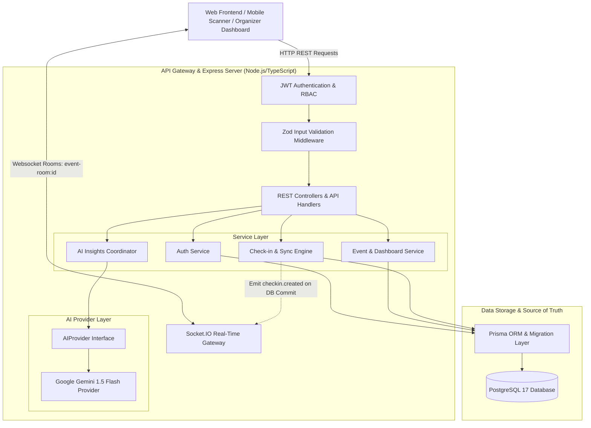
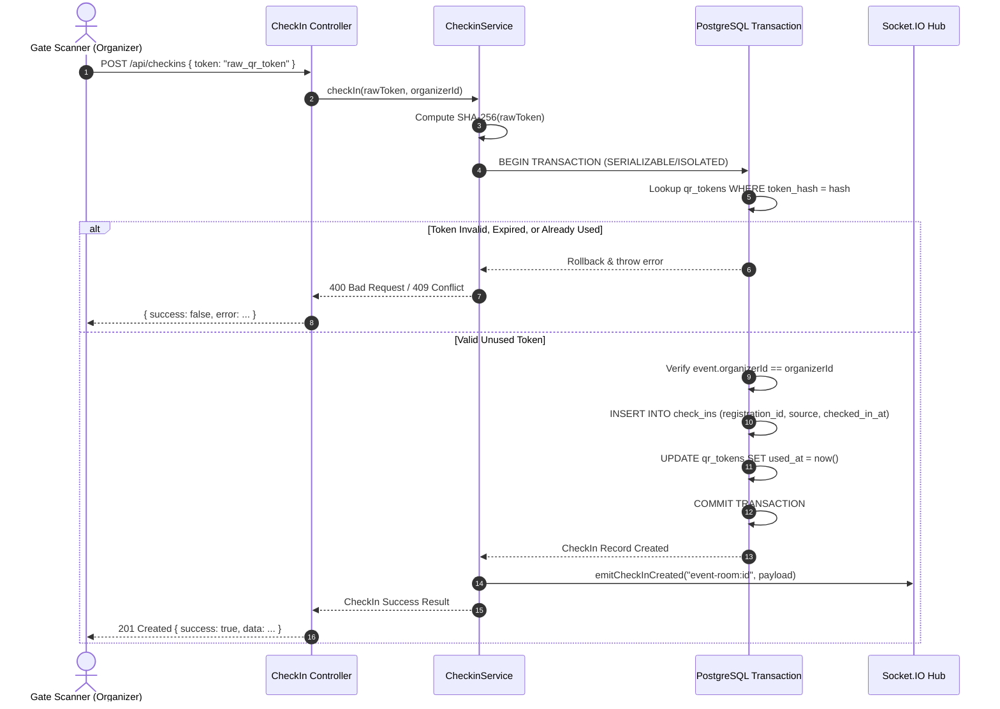
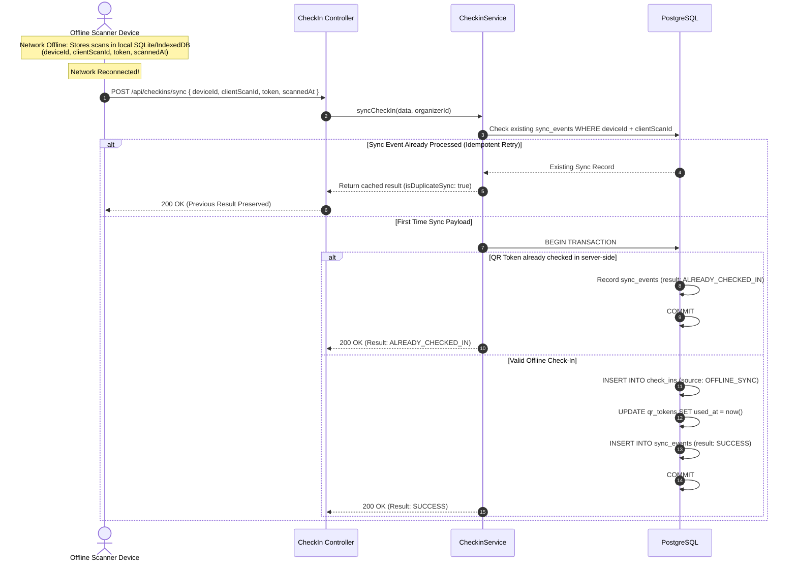
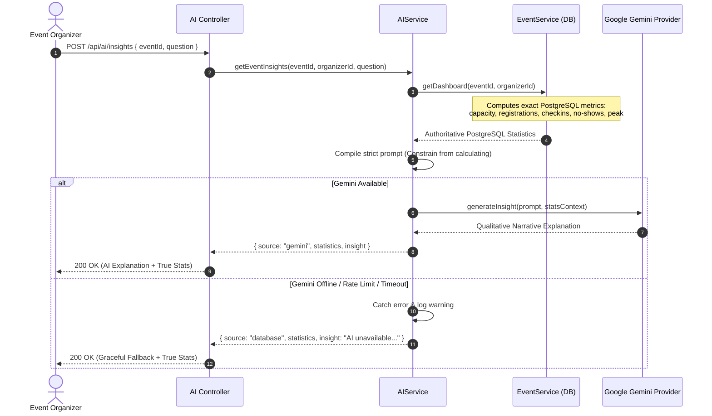

# System Architecture & Technical Specification

This document provides a comprehensive technical overview of the **Event Check-In System** architecture, detailing system components, interaction flows, data isolation, and security guarantees.

---

## 1. High-Level Architecture Overview

The Event Check-In System is built as a robust, concurrency-safe, offline-resilient event management and gate check-in platform.

---

## 2. Layered Component Architecture

### 1. Presentation & Routing Layer (`src/routes`, `src/controllers`)
- **Routers**: Map HTTP endpoints cleanly to controller methods with route-specific middleware.
- **Controllers**: Thin orchestration handlers. Responsible for extracting validated request payloads, invoking domain services, and shaping consistent JSON/CSV responses.
- **Error Handling**: Global error middleware catches all operational (`AppError`, `NotFoundError`, `ConflictError`, `ForbiddenError`, `ValidationError`) and uncaught errors, translating them into standard structured responses.

### 2. Validation & Security Layer (`src/middleware`, `src/validators`)
- **Zod Schemas**: Strict compile-time and runtime validation for path params, query strings, and JSON request bodies before reaching business logic.
- **JWT Authentication**: Asymmetric/HMAC bearer token verification with user hydration.
- **Role-Based Access Control (RBAC)**: Fine-grained authorization enforcing `Role.ORGANIZER` vs `Role.ATTENDEE` restrictions.
- **Resource Ownership**: Strict verification preventing cross-organizer data leakage or unauthorized check-in attempts.

### 3. Business Service Layer (`src/services`)
- **`AuthService`**: Password hashing via `bcrypt` (10 rounds), credential verification, token issuance.
- **`EventService`**: Event CRUD, PostgreSQL-backed dashboard aggregation, and RFC-4180 compliant CSV export generation.
- **`CheckinService`**: High-concurrency online QR check-in, token hash resolution, and offline batch synchronization engine with full idempotency.
- **`AIService`**: Provider-agnostic domain coordinator bridging PostgreSQL statistics with LLM explanation prompts.

### 4. Real-Time Layer (`src/utils/socket.ts`)
- **Socket.IO Integration**: Room-scoped broadcast channel (`event-room:${eventId}`).
- **Strict Post-Commit Hook**: Events (`checkin.created`) are dispatched **strictly after** the database transaction successfully commits.

### 5. Persistence & Transaction Layer (`prisma/schema.prisma`)
- **PostgreSQL 17 Engine**: Relational consistency, row-level locks (`FOR UPDATE`), and ACID transactions.
- **Prisma Client**: Type-safe query generation and automated migrations.

---

## 3. Core Interaction & Data Flows

### A. Concurrent Online Check-In Flow (HR1 & HR2)

---

### B. Offline-First Synchronization Flow (HR3)

---

### C. AI Event Insights Flow (HR4)

---

## 4. Key Security Principles

1. **Defense-in-Depth Concurrency**: Combines row-level locks (`SELECT ... FOR UPDATE`), transaction isolation, and hardware-level unique database constraints.
2. **Zero Plaintext QR Exposure**: Raw tokens exist only on the user's ticket and are hashed with SHA-256 before database lookup and storage.
3. **Strict Resource Boundary**: Organizers can only inspect, export, check in, or request AI insights for events they explicitly own.
4. **Resilient Provider Architecture**: External dependencies (Socket.IO, Gemini LLM) are decoupled from database transaction boundaries.
