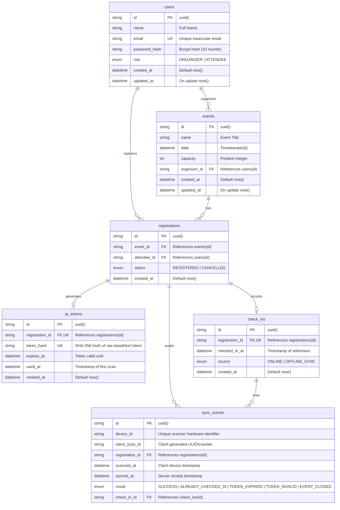

# Database Schema, Indexing & Concurrency Design

This document details the relational data model, indexing strategies, referential integrity rules, and transactional guarantees implemented in PostgreSQL for the **Event Check-In System**.

---

## 1. Entity Relationship Diagram (ERD)



---

## 2. Table Specifications & DDL

### 1. `users` Table
Stores user credentials, roles, and profiles.

```sql
CREATE TABLE users (
    id            TEXT PRIMARY KEY DEFAULT gen_random_uuid(),
    name          TEXT NOT NULL,
    email         TEXT UNIQUE NOT NULL,
    password_hash TEXT NOT NULL,
    role          Role NOT NULL DEFAULT 'ATTENDEE',
    created_at    TIMESTAMPTZ NOT NULL DEFAULT NOW(),
    updated_at    TIMESTAMPTZ NOT NULL DEFAULT NOW()
);
```

### 2. `events` Table
Stores event metadata, capacity limits, and organizer ownership.

```sql
CREATE TABLE events (
    id           TEXT PRIMARY KEY DEFAULT gen_random_uuid(),
    name         TEXT NOT NULL,
    date         TIMESTAMPTZ(6) NOT NULL,
    capacity     INTEGER NOT NULL,
    organizer_id TEXT NOT NULL REFERENCES users(id) ON DELETE CASCADE,
    created_at   TIMESTAMPTZ NOT NULL DEFAULT NOW(),
    updated_at   TIMESTAMPTZ NOT NULL DEFAULT NOW()
);

CREATE INDEX events_organizer_id_idx ON events(organizer_id);
```

### 3. `registrations` Table
Tracks user registration to events.

```sql
CREATE TABLE registrations (
    id          TEXT PRIMARY KEY DEFAULT gen_random_uuid(),
    event_id    TEXT NOT NULL REFERENCES events(id) ON DELETE CASCADE,
    attendee_id TEXT NOT NULL REFERENCES users(id) ON DELETE CASCADE,
    status      RegistrationStatus NOT NULL DEFAULT 'REGISTERED',
    created_at  TIMESTAMPTZ NOT NULL DEFAULT NOW(),
    CONSTRAINT registrations_event_id_attendee_id_key UNIQUE (event_id, attendee_id)
);

CREATE INDEX registrations_attendee_id_idx ON registrations(attendee_id);
CREATE INDEX registrations_event_id_idx ON registrations(event_id);
```

### 4. `qr_tokens` Table
Stores single-use hashed security tokens. Raw tokens are **never** stored in the database.

```sql
CREATE TABLE qr_tokens (
    id              TEXT PRIMARY KEY DEFAULT gen_random_uuid(),
    registration_id TEXT UNIQUE NOT NULL REFERENCES registrations(id) ON DELETE CASCADE,
    token_hash      TEXT UNIQUE NOT NULL,
    expires_at      TIMESTAMPTZ NOT NULL,
    used_at         TIMESTAMPTZ,
    created_at      TIMESTAMPTZ NOT NULL DEFAULT NOW()
);
```

### 5. `check_ins` Table
Stores confirmed gate admissions. Enforces exact-once check-in via a unique constraint on `registration_id`.

```sql
CREATE TABLE check_ins (
    id              TEXT PRIMARY KEY DEFAULT gen_random_uuid(),
    registration_id TEXT UNIQUE NOT NULL REFERENCES registrations(id) ON DELETE CASCADE,
    checked_in_at   TIMESTAMPTZ NOT NULL,
    source          CheckInSource NOT NULL,
    created_at      TIMESTAMPTZ NOT NULL DEFAULT NOW()
);
```

### 6. `sync_events` Table
Audit trail and idempotency barrier for offline handheld scanner devices.

```sql
CREATE TABLE sync_events (
    id              TEXT PRIMARY KEY DEFAULT gen_random_uuid(),
    device_id       TEXT NOT NULL,
    client_scan_id  TEXT NOT NULL,
    registration_id TEXT REFERENCES registrations(id) ON DELETE SET NULL,
    scanned_at      TIMESTAMPTZ NOT NULL,
    synced_at       TIMESTAMPTZ NOT NULL DEFAULT NOW(),
    result          SyncResult NOT NULL,
    check_in_id     TEXT REFERENCES check_ins(id) ON DELETE SET NULL,
    CONSTRAINT sync_events_device_id_client_scan_id_key UNIQUE (device_id, client_scan_id)
);

CREATE INDEX sync_events_registration_id_idx ON sync_events(registration_id);
CREATE INDEX sync_events_check_in_id_idx ON sync_events(check_in_id);
```

---

## 3. Critical Integrity & Concurrency Constraints

| Constraint | Purpose | Concurrency Defense |
| :--- | :--- | :--- |
| `UNIQUE(event_id, attendee_id)` | Prevents duplicate event registrations | Immediate rejection of concurrent double-booking by same user |
| `UNIQUE(registration_id)` on `check_ins` | Prevents duplicate gate entries | Rejects second concurrent scan of the same ticket with `409 ALREADY_CHECKED_IN` |
| `UNIQUE(token_hash)` on `qr_tokens` | Token collision & replay protection | Guarantees exact 1:1 mapping between token and registration |
| `UNIQUE(device_id, client_scan_id)` on `sync_events` | Idempotent offline synchronization | Prevents duplicate processing when offline devices retry sync requests |
| `SELECT ... FOR UPDATE` on `events` | Strict capacity enforcement | Serializes concurrent registration transactions, ensuring capacity is never exceeded |

---

## 4. Referential Actions & Data Lifecycle

- **`ON DELETE CASCADE`**:
  - Deleting a `User` cascades to their created `Event` records and `Registration` entries.
  - Deleting an `Event` cascades to all `Registration`, `QrToken`, and `CheckIn` records associated with it.
  - Deleting a `Registration` removes the associated `QrToken` and `CheckIn`.
- **`ON DELETE SET NULL`**:
  - In `sync_events`, `registration_id` and `check_in_id` use `SET NULL` to maintain an immutable audit trail even if an attendee or event is subsequently modified or purged.

---

## 5. Seed Data Architecture

The automated database seeder (`prisma/seed.ts`) populates standard environments with:
- **Organizer**: `organizer@mic.dev` (`Role.ORGANIZER`)
- **12 Attendees**: `attendee1@mic.dev` through `attendee12@mic.dev` (`Role.ATTENDEE`)
- **Events**:
  1. `MIC Annual Hackathon 2026` (Capacity: 10, Registered: 10/10 FULL, Checked-in: 6)
  2. `MIC Networking Night` (Capacity: 20, Registered: 8/20, Checked-in: 0)
- **Active QR Tokens**: Cryptographically hashed tokens linked to all registrations.
- **Check-In Records**: Mix of `ONLINE` and `OFFLINE_SYNC` sources with real temporal distribution.
